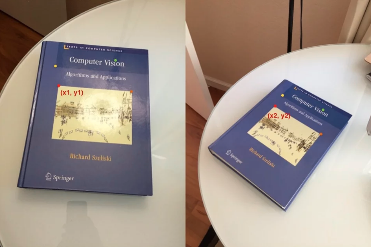
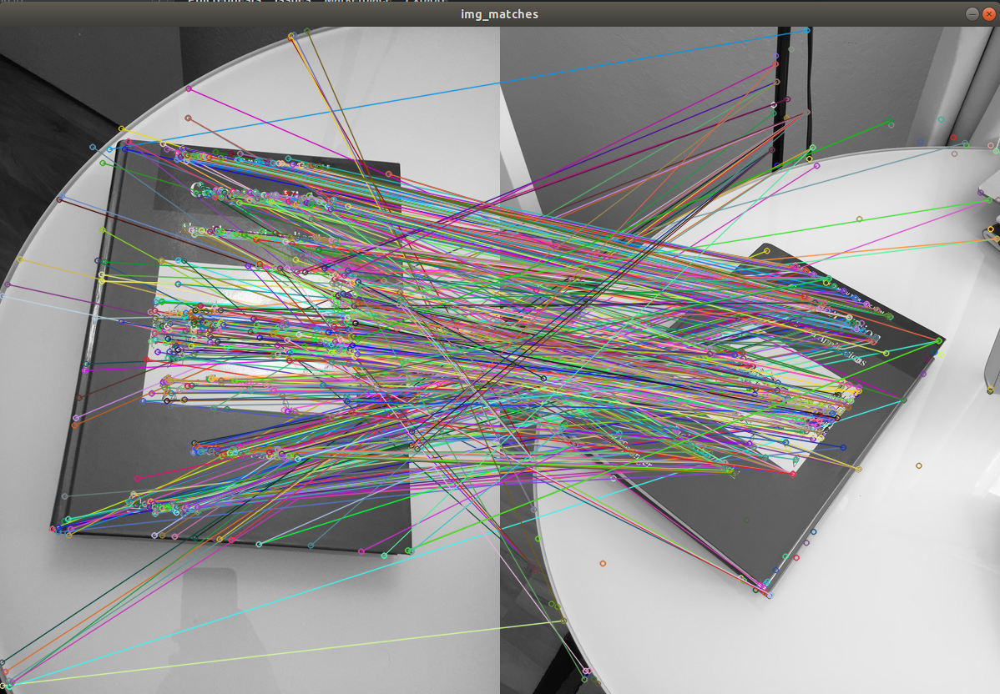
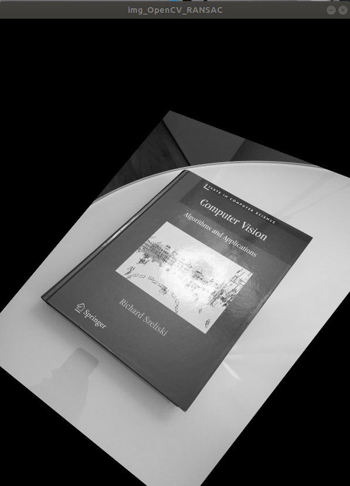
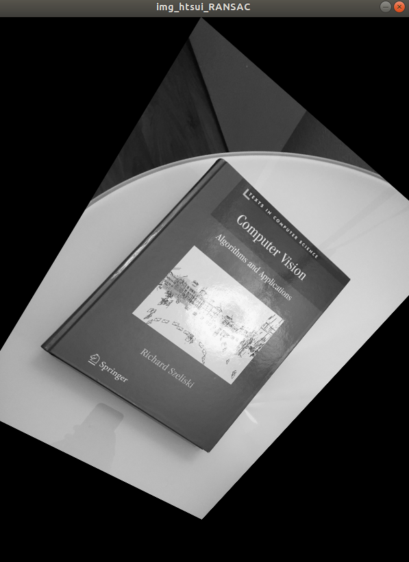

# RANSAC for homography estimation

## Dependency
- CMake 2.8+
- Eigen3
- OpenCV2

## WriteUp.
`git clone https://github.com/Tsuihao/ransac_homography.git`

`cd ransac_homography`

`cmake -DCMAKE_BUILD_TYPE=Debug .`

`./ransac_homography`

We first use the four fixed point to extract the baseline of Homogrpahy
(Great reference turtorial here [Ref](https://www.learnopencv.com/homography-examples-using-opencv-python-c/))

The baseline homography should look like
(perspective transformation)

Now in order to generate the "a lot of" corresponding points for RANSAC.
we use the SIFT detector.

By default, opencv provide the fucntion `findhomography` which uses RANSAC under the hood.
The result homography from opencv - `findhomography`.
(As can be seen, it looks identical as the baseline images (that is what we are looking for!))

We are going to compare our own implementation of RANSAC.
It's clear that the implementation has some bugs. check the below section

## Potential improvements
- We are assume h33 = 1 (the (3, 3) element of homography matrix)
    - [Ref](http://www.cse.psu.edu/~rtc12/CSE486/lecture16.pdf)
    - [Ref](https://www.uio.no/studier/emner/matnat/its/nedlagte-emner/UNIK4690/v16/forelesninger/lecture_4_3-estimating-homographies-from-feature-correspondences.pdf)
    - [Ref](http://6.869.csail.mit.edu/fa12/lectures/lecture13ransac/lecture13ransac.pdf)
    - It might be more robust to use SVD and without assumption of h33 = 1
- The current iteration number is hard coded. It can use the adaptive approach to optimize it.
- While RANSAC generating random samples, we might need to do a pre-check to make sure **there is no 3 points sit on a line** (OpenCV does this check)
- The cost function uses `sqrt`(**forward projection error** + **backward projection error**). 
- Lacking a quantitive method to estimate a **threshold** for **inliers**

